# Sơ đồ SpotWay

Use case, context, kiến trúc, ERD, trạng thái và tuần tự của nền tảng chỉ đường trong nhà SpotWay. Khớp mã nguồn nhánh final, cập nhật 19/11/2026.

## Luồng tổng thể

Từ lúc khách đặt gói tới khi khách trong tòa nhận chỉ đường. Mỗi tòa có Manager riêng, dữ liệu mỗi tòa tách biệt.

### Luồng nghiệp vụ end-to-end

Đường chính của dự án, theo thứ tự thực hiện.

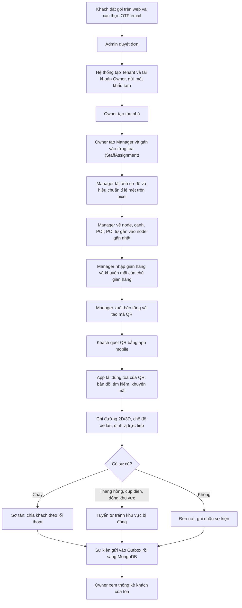
```mermaid
flowchart TD
  A["Khách đặt gói trên web và xác thực OTP email"] --> B["Admin duyệt đơn"]
  B --> C["Hệ thống tạo Tenant và tài khoản Owner, gửi mật khẩu tạm"]
  C --> D["Owner tạo tòa nhà"]
  D --> E["Owner tạo Manager và gán vào từng tòa (StaffAssignment)"]
  E --> F["Manager tải ảnh sơ đồ và hiệu chuẩn tỉ lệ mét trên pixel"]
  F --> G["Manager vẽ node, cạnh, POI; POI tự gắn vào node gần nhất"]
  G --> H["Manager nhập gian hàng và khuyến mãi của chủ gian hàng"]
  H --> I["Manager xuất bản tầng và tạo mã QR"]
  I --> J["Khách quét QR bằng app mobile"]
  J --> K["App tải đúng tòa của QR: bản đồ, tìm kiếm, khuyến mãi"]
  K --> L["Chỉ đường 2D/3D, chế độ xe lăn, định vị trực tiếp"]
  L --> M{"Có sự cố?"}
  M -- "Cháy" --> N["Sơ tán: chia khách theo lối thoát"]
  M -- "Thang hỏng, cúp điện, đóng khu vực" --> O["Tuyến tự tránh khu vực bị đóng"]
  M -- "Không" --> P["Đến nơi, ghi nhận sự kiện"]
  N --> Q["Sự kiện gửi vào Outbox rồi sang MongoDB"]
  O --> Q
  P --> Q
  Q --> R["Owner xem thống kê khách của tòa"]
```

## Use case

Sáu tác nhân và các chức năng chính. Manager và Owner chỉ thao tác trong phạm vi tòa của mình.

### Biểu đồ use case

Đường nối là quan hệ tác nhân và chức năng. Hộp ngoài là ranh giới hệ thống.

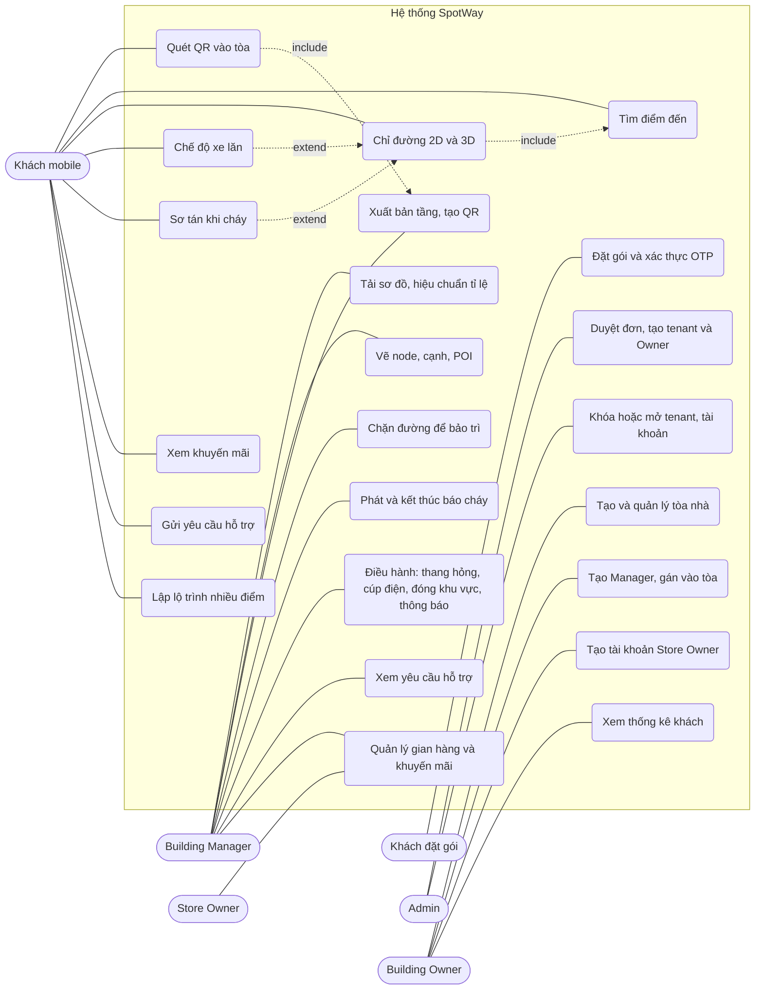
```mermaid
flowchart LR
  KH(["Khách đặt gói"])
  AD(["Admin"])
  OW(["Building Owner"])
  MG(["Building Manager"])
  SO(["Store Owner"])
  GU(["Khách mobile"])
  subgraph SYS["Hệ thống SpotWay"]
    direction TB
    U1("Đặt gói và xác thực OTP")
    U2("Duyệt đơn, tạo tenant và Owner")
    U3("Khóa hoặc mở tenant, tài khoản")
    U4("Tạo và quản lý tòa nhà")
    U5("Tạo Manager, gán vào tòa")
    U6("Tạo tài khoản Store Owner")
    U7("Xem thống kê khách")
    U8("Tải sơ đồ, hiệu chuẩn tỉ lệ")
    U9("Vẽ node, cạnh, POI")
    U10("Xuất bản tầng, tạo QR")
    U11("Chặn đường để bảo trì")
    U12("Phát và kết thúc báo cháy")
    U13("Điều hành: thang hỏng, cúp điện, đóng khu vực, thông báo")
    U14("Xem yêu cầu hỗ trợ")
    U15("Quản lý gian hàng và khuyến mãi")
    U16("Quét QR vào tòa")
    U17("Tìm điểm đến")
    U18("Chỉ đường 2D và 3D")
    U19("Chế độ xe lăn")
    U20("Sơ tán khi cháy")
    U21("Xem khuyến mãi")
    U22("Gửi yêu cầu hỗ trợ")
    U23("Lập lộ trình nhiều điểm")
  end
  KH --- U1
  AD --- U2
  AD --- U3
  OW --- U4
  OW --- U5
  OW --- U6
  OW --- U7
  MG --- U8
  MG --- U9
  MG --- U10
  MG --- U11
  MG --- U12
  MG --- U13
  MG --- U14
  MG --- U15
  SO --- U15
  GU --- U16
  GU --- U17
  GU --- U18
  GU --- U19
  GU --- U20
  GU --- U21
  GU --- U22
  GU --- U23
  U18 -. "include" .-> U17
  U19 -. "extend" .-> U18
  U20 -. "extend" .-> U18
  U16 -. "include" .-> U10
```

## Context diagram

Hệ thống là một khối; xung quanh là người dùng và dịch vụ ngoài.

### Context diagram (mức 0)

Tên dịch vụ email, OAuth và lưu trữ ảnh nên đối chiếu lại với cấu hình triển khai thật của nhóm.

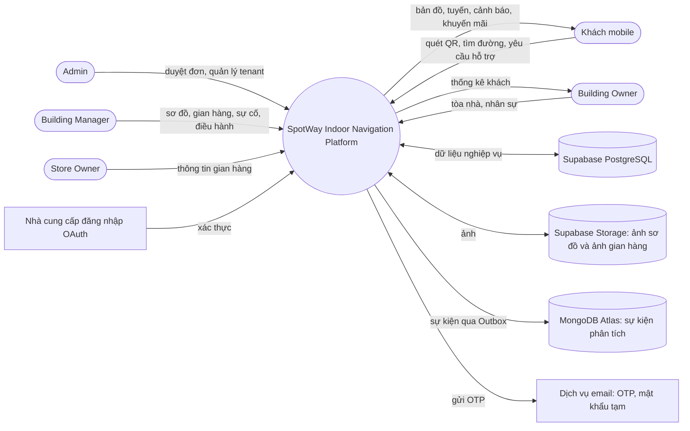
```mermaid
flowchart LR
  AD(["Admin"])
  OW(["Building Owner"])
  MG(["Building Manager"])
  SO(["Store Owner"])
  GU(["Khách mobile"])
  SYS(("SpotWay Indoor Navigation Platform"))
  PG[("Supabase PostgreSQL")]
  ST[("Supabase Storage: ảnh sơ đồ và ảnh gian hàng")]
  MG2[("MongoDB Atlas: sự kiện phân tích")]
  EM["Dịch vụ email: OTP, mật khẩu tạm"]
  OA["Nhà cung cấp đăng nhập OAuth"]
  AD -->|"duyệt đơn, quản lý tenant"| SYS
  OW -->|"tòa nhà, nhân sự"| SYS
  MG -->|"sơ đồ, gian hàng, sự cố, điều hành"| SYS
  SO -->|"thông tin gian hàng"| SYS
  GU -->|"quét QR, tìm đường, yêu cầu hỗ trợ"| SYS
  SYS -->|"bản đồ, tuyến, cảnh báo, khuyến mãi"| GU
  SYS -->|"thống kê khách"| OW
  SYS <-->|"dữ liệu nghiệp vụ"| PG
  SYS <-->|"ảnh"| ST
  SYS -->|"sự kiện qua Outbox"| MG2
  SYS -->|"gửi OTP"| EM
  OA -->|"xác thực"| SYS
```

## Kiến trúc

Ba ứng dụng khách, một BE NestJS, hai cơ sở dữ liệu. Trạng thái trực tiếp (báo cháy, điều hành) nằm trong bộ nhớ BE.

### Kiến trúc hệ thống

Mobile gọi các endpoint công khai theo tòa; web gọi endpoint có JWT.

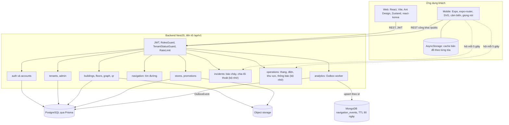
```mermaid
flowchart TB
  subgraph CLIENT["Ứng dụng khách"]
    WEB["Web: React, Vite, Ant Design, Zustand, react-konva"]
    MOB["Mobile: Expo, expo-router, SVG, cảm biến, giọng nói"]
    CACHE[("AsyncStorage: cache bản đồ theo từng tòa")]
  end
  subgraph BE["Backend NestJS, tiền tố /api/v1"]
    GUARD["JWT, RolesGuard, TenantStatusGuard, RateLimit"]
    AUTH["auth và accounts"]
    TEN["tenants, admin"]
    GEO["buildings, floors, graph, qr"]
    NAV["navigation: tìm đường"]
    STO["stores, promotions"]
    INC["incidents: báo cháy, chia lối thoát (bộ nhớ)"]
    OPS["operations: thang, điện, khu vực, thông báo (bộ nhớ)"]
    ANA["analytics: Outbox worker"]
  end
  PG[("PostgreSQL qua Prisma")]
  MGO[("MongoDB navigation_events, TTL 90 ngày")]
  OBJ[("Object storage")]
  WEB -->|"REST, JWT"| GUARD
  MOB -->|"REST công khai /public"| GUARD
  MOB --- CACHE
  GUARD --> AUTH
  GUARD --> TEN
  GUARD --> GEO
  GUARD --> NAV
  GUARD --> STO
  GUARD --> INC
  GUARD --> OPS
  GUARD --> ANA
  AUTH --> PG
  TEN --> PG
  GEO --> PG
  GEO --> OBJ
  STO --> PG
  STO --> OBJ
  ANA -->|"OutboxEvent"| PG
  ANA -->|"upsert theo id"| MGO
  MOB -. "hỏi mỗi 5 giây" .-> INC
  MOB -. "hỏi mỗi 5 giây" .-> OPS
```

### Phân quyền theo tòa

Manager chỉ làm việc trên tòa được gán; mọi truy cập chéo tenant bị chặn.

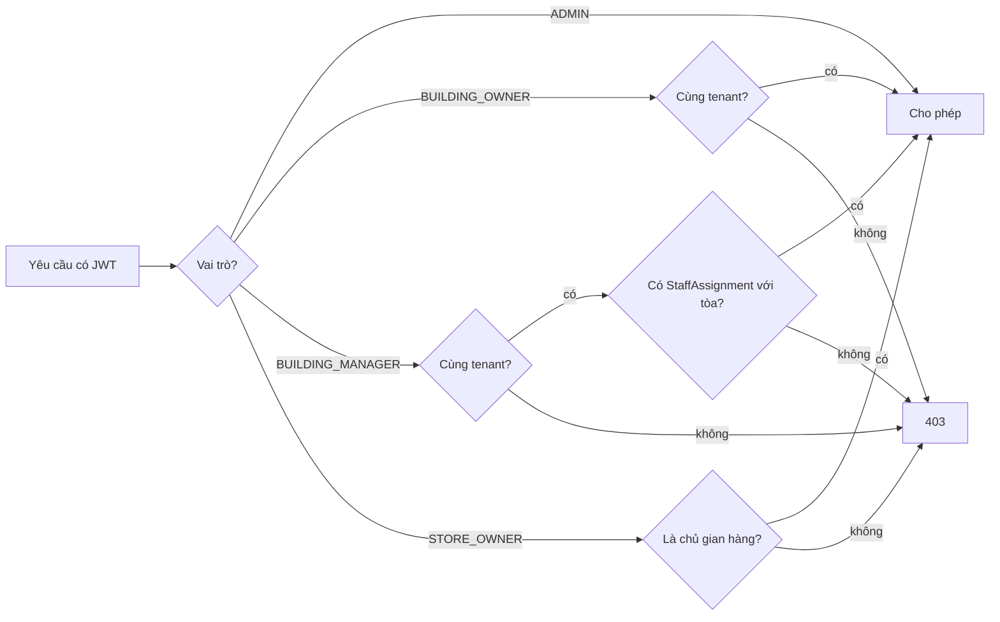
```mermaid
flowchart LR
  REQ["Yêu cầu có JWT"] --> R{"Vai trò?"}
  R -- "ADMIN" --> OK["Cho phép"]
  R -- "BUILDING_OWNER" --> T{"Cùng tenant?"}
  R -- "BUILDING_MANAGER" --> T2{"Cùng tenant?"}
  R -- "STORE_OWNER" --> S{"Là chủ gian hàng?"}
  T -- "có" --> OK
  T -- "không" --> NO["403"]
  T2 -- "có" --> A{"Có StaffAssignment với tòa?"}
  T2 -- "không" --> NO
  A -- "có" --> OK
  A -- "không" --> NO
  S -- "có" --> OK
  S -- "không" --> NO
```

## ERD

Khớp schema.prisma. Chia ba cụm cho dễ đọc; Building, Floor, Node xuất hiện ở nhiều cụm.

### Cụm tài khoản

Tenant, người dùng, phiên và đơn gói.

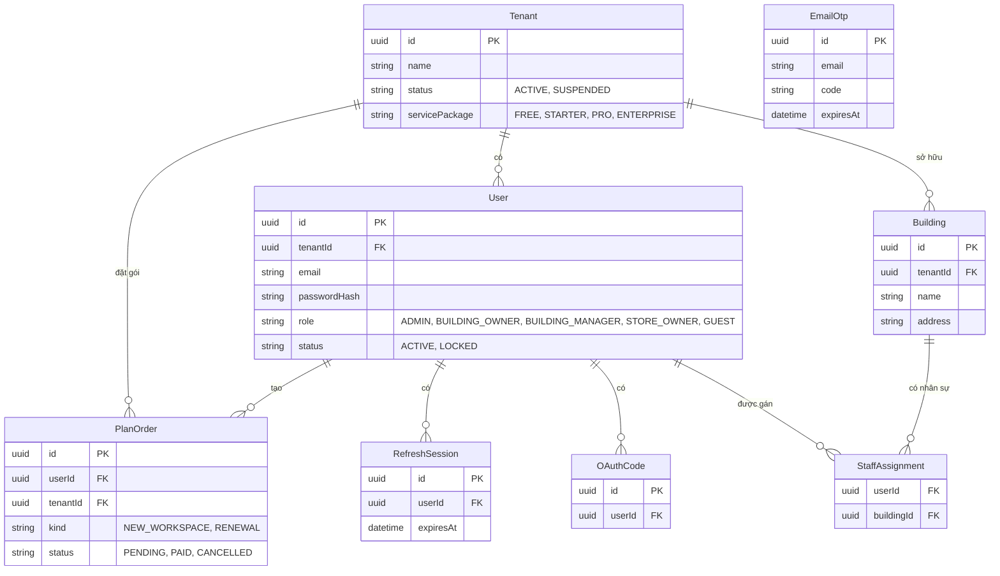
```mermaid
erDiagram
  Tenant ||--o{ User : "có"
  Tenant ||--o{ Building : "sở hữu"
  Tenant ||--o{ PlanOrder : "đặt gói"
  User ||--o{ PlanOrder : "tạo"
  User ||--o{ RefreshSession : "có"
  User ||--o{ OAuthCode : "có"
  User ||--o{ StaffAssignment : "được gán"
  Building ||--o{ StaffAssignment : "có nhân sự"
  Tenant {
    uuid id PK
    string name
    string status "ACTIVE, SUSPENDED"
    string servicePackage "FREE, STARTER, PRO, ENTERPRISE"
  }
  User {
    uuid id PK
    uuid tenantId FK
    string email
    string passwordHash
    string role "ADMIN, BUILDING_OWNER, BUILDING_MANAGER, STORE_OWNER, GUEST"
    string status "ACTIVE, LOCKED"
  }
  PlanOrder {
    uuid id PK
    uuid userId FK
    uuid tenantId FK
    string kind "NEW_WORKSPACE, RENEWAL"
    string status "PENDING, PAID, CANCELLED"
  }
  StaffAssignment {
    uuid userId FK
    uuid buildingId FK
  }
  RefreshSession {
    uuid id PK
    uuid userId FK
    datetime expiresAt
  }
  OAuthCode {
    uuid id PK
    uuid userId FK
  }
  EmailOtp {
    uuid id PK
    string email
    string code
    datetime expiresAt
  }
  Building {
    uuid id PK
    uuid tenantId FK
    string name
    string address
  }
```

### Cụm không gian

Tòa nhà, tầng, đồ thị đường đi và các điểm nối giữa các tầng.

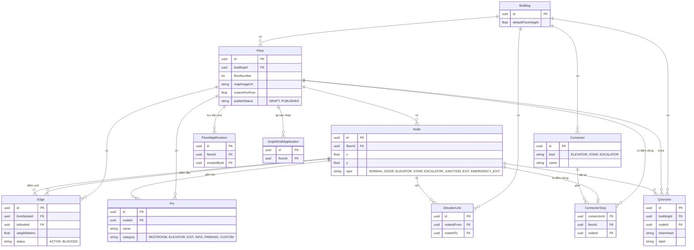
```mermaid
erDiagram
  Building ||--o{ Floor : "có"
  Building ||--o{ Connector : "có"
  Building ||--o{ ElevatorLink : "có"
  Building ||--o{ QrAnchor : "có"
  Floor ||--o{ Node : "có"
  Floor ||--o{ Edge : "có"
  Floor ||--o{ Poi : "có"
  Floor ||--o{ FloorMapRevision : "lưu bản sửa"
  Floor ||--o{ GraphDraftApplication : "áp bản nháp"
  Floor ||--o{ ConnectorStop : "có điểm dừng"
  Floor ||--o{ QrAnchor : "chứa"
  Node ||--o{ Edge : "điểm đầu"
  Node ||--o{ Edge : "điểm cuối"
  Node ||--o{ Poi : "gắn vào"
  Node ||--o{ QrAnchor : "đặt tại"
  Node ||--o{ ElevatorLink : "nối"
  Node ||--o| ConnectorStop : "là điểm dừng"
  Connector ||--o{ ConnectorStop : "gồm"
  Building {
    uuid id PK
    float defaultFloorHeight
  }
  Floor {
    uuid id PK
    uuid buildingId FK
    int floorNumber
    string mapImageUrl
    float metersPerPixel
    string publishStatus "DRAFT, PUBLISHED"
  }
  Node {
    uuid id PK
    uuid floorId FK
    float x
    float y
    string type "NORMAL, DOOR, ELEVATOR, STAIR, ESCALATOR, JUNCTION, EXIT, EMERGENCY_EXIT"
  }
  Edge {
    uuid id PK
    uuid fromNodeId FK
    uuid toNodeId FK
    float weightMeters
    string status "ACTIVE, BLOCKED"
  }
  Poi {
    uuid id PK
    uuid nodeId FK
    string name
    string category "RESTROOM, ELEVATOR, EXIT, INFO, PARKING, CUSTOM"
  }
  Connector {
    uuid id PK
    string kind "ELEVATOR, STAIR, ESCALATOR"
    string name
  }
  ConnectorStop {
    uuid connectorId FK
    uuid floorId FK
    uuid nodeId FK
  }
  ElevatorLink {
    uuid id PK
    uuid nodeIdFrom FK
    uuid nodeIdTo FK
  }
  QrAnchor {
    uuid id PK
    uuid buildingId FK
    uuid nodeId FK
    string tokenHash
    string label
  }
  FloorMapRevision {
    uuid id PK
    uuid floorId FK
    uuid createdById FK
  }
  GraphDraftApplication {
    uuid id PK
    uuid floorId FK
  }
```

### Cụm thương mại và phân tích

Gian hàng, khuyến mãi, và đường đi của sự kiện từ Postgres sang MongoDB.

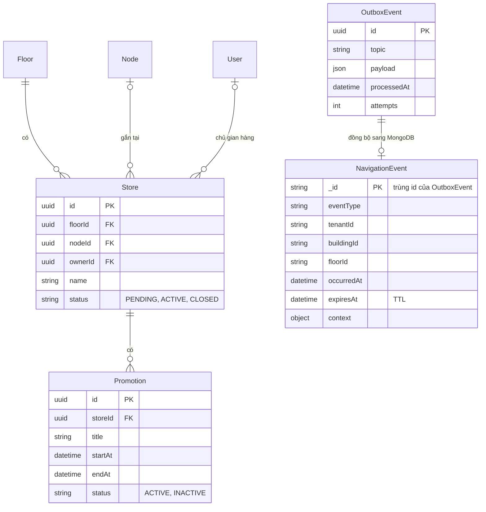
```mermaid
erDiagram
  Floor ||--o{ Store : "có"
  Node |o--o{ Store : "gắn tại"
  User |o--o{ Store : "chủ gian hàng"
  Store ||--o{ Promotion : "có"
  OutboxEvent ||--o| NavigationEvent : "đồng bộ sang MongoDB"
  Store {
    uuid id PK
    uuid floorId FK
    uuid nodeId FK
    uuid ownerId FK
    string name
    string status "PENDING, ACTIVE, CLOSED"
  }
  Promotion {
    uuid id PK
    uuid storeId FK
    string title
    datetime startAt
    datetime endAt
    string status "ACTIVE, INACTIVE"
  }
  OutboxEvent {
    uuid id PK
    string topic
    json payload
    datetime processedAt
    int attempts
  }
  NavigationEvent {
    string _id PK "trùng id của OutboxEvent"
    string eventType
    string tenantId
    string buildingId
    string floorId
    datetime occurredAt
    datetime expiresAt "TTL"
    object context
  }
```

## Sơ đồ trạng thái

Trạng thái của các đối tượng chính. Báo cháy và điều hành chỉ sống trong bộ nhớ BE nên mất khi khởi động lại.

### Tầng bản đồ

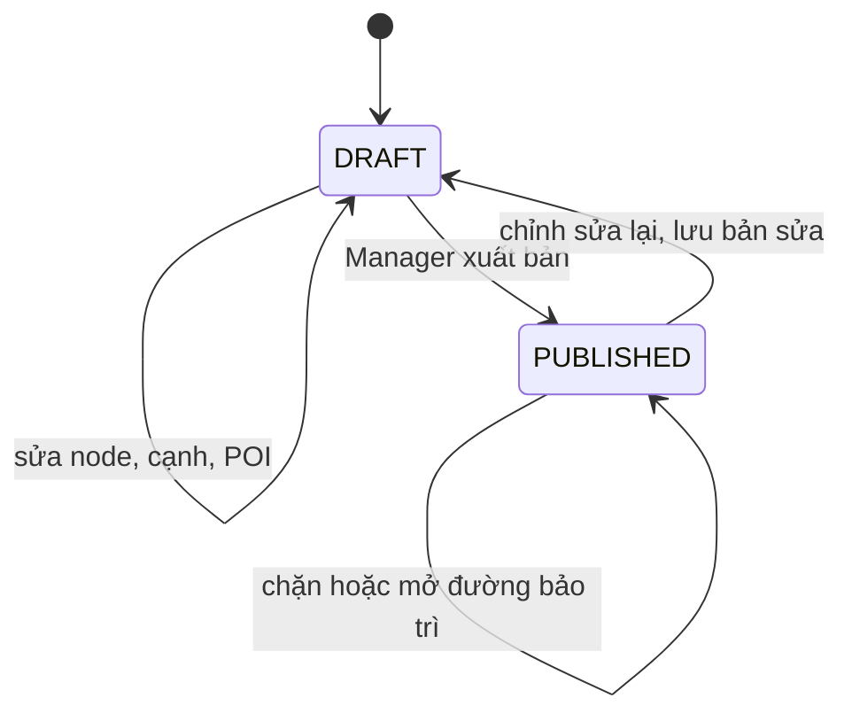
```mermaid
stateDiagram-v2
  [*] --> DRAFT
  DRAFT --> DRAFT: sửa node, cạnh, POI
  DRAFT --> PUBLISHED: Manager xuất bản
  PUBLISHED --> DRAFT: chỉnh sửa lại, lưu bản sửa
  PUBLISHED --> PUBLISHED: chặn hoặc mở đường bảo trì
```

### Báo cháy của một tòa

Theo từng tòa; khách tòa khác không bị ảnh hưởng.

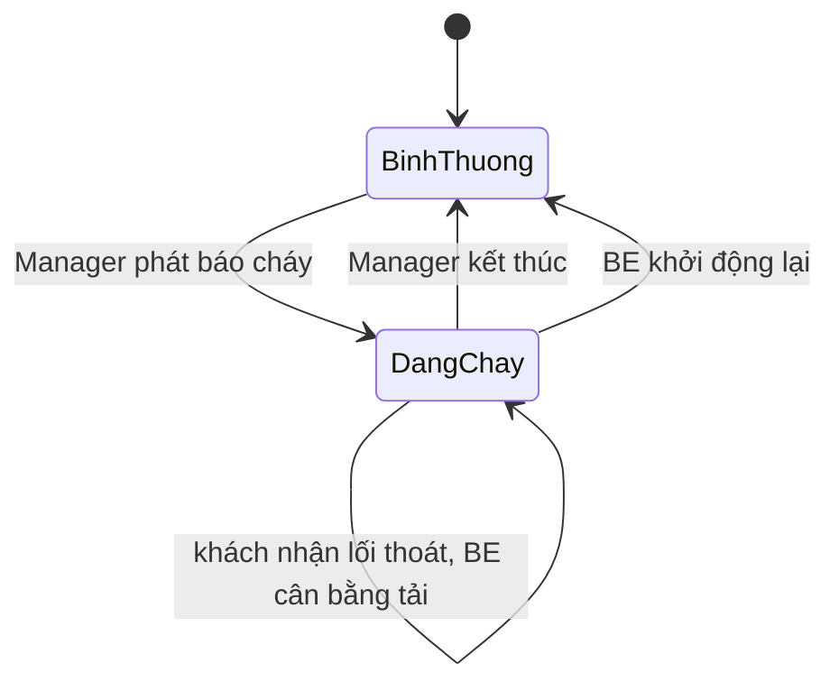
```mermaid
stateDiagram-v2
  [*] --> BinhThuong
  BinhThuong --> DangChay: Manager phát báo cháy
  DangChay --> DangChay: khách nhận lối thoát, BE cân bằng tải
  DangChay --> BinhThuong: Manager kết thúc
  DangChay --> BinhThuong: BE khởi động lại
```

### Điều hành của một tòa

Thang máy, cúp điện, đóng khu vực và thông báo là bốn công tắc độc lập.

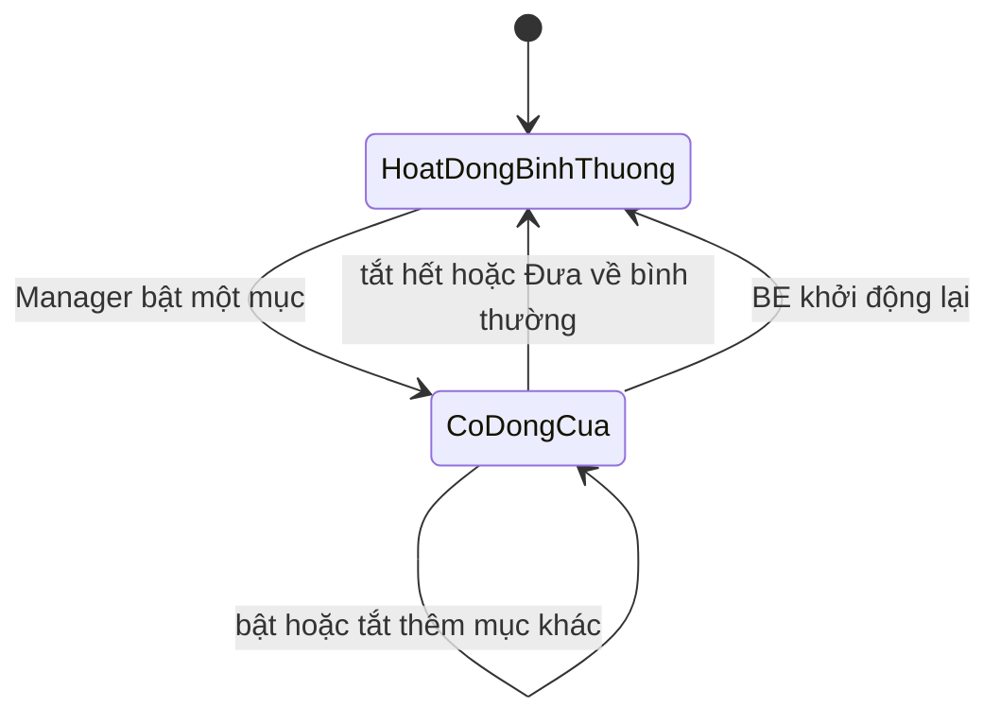
```mermaid
stateDiagram-v2
  [*] --> HoatDongBinhThuong
  HoatDongBinhThuong --> CoDongCua: Manager bật một mục
  CoDongCua --> CoDongCua: bật hoặc tắt thêm mục khác
  CoDongCua --> HoatDongBinhThuong: tắt hết hoặc Đưa về bình thường
  CoDongCua --> HoatDongBinhThuong: BE khởi động lại
```

### Đơn gói, tenant, tài khoản

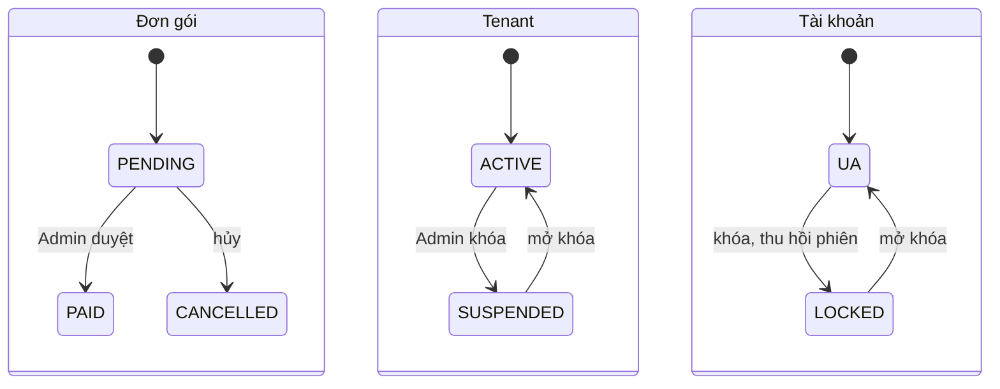
```mermaid
stateDiagram-v2
  state "Đơn gói" as O {
    [*] --> PENDING
    PENDING --> PAID: Admin duyệt
    PENDING --> CANCELLED: hủy
  }
  state "Tenant" as T {
    [*] --> ACTIVE
    ACTIVE --> SUSPENDED: Admin khóa
    SUSPENDED --> ACTIVE: mở khóa
  }
  state "Tài khoản" as U {
    [*] --> UA
    UA --> LOCKED: khóa, thu hồi phiên
    LOCKED --> UA: mở khóa
  }
```

### Gian hàng và khuyến mãi

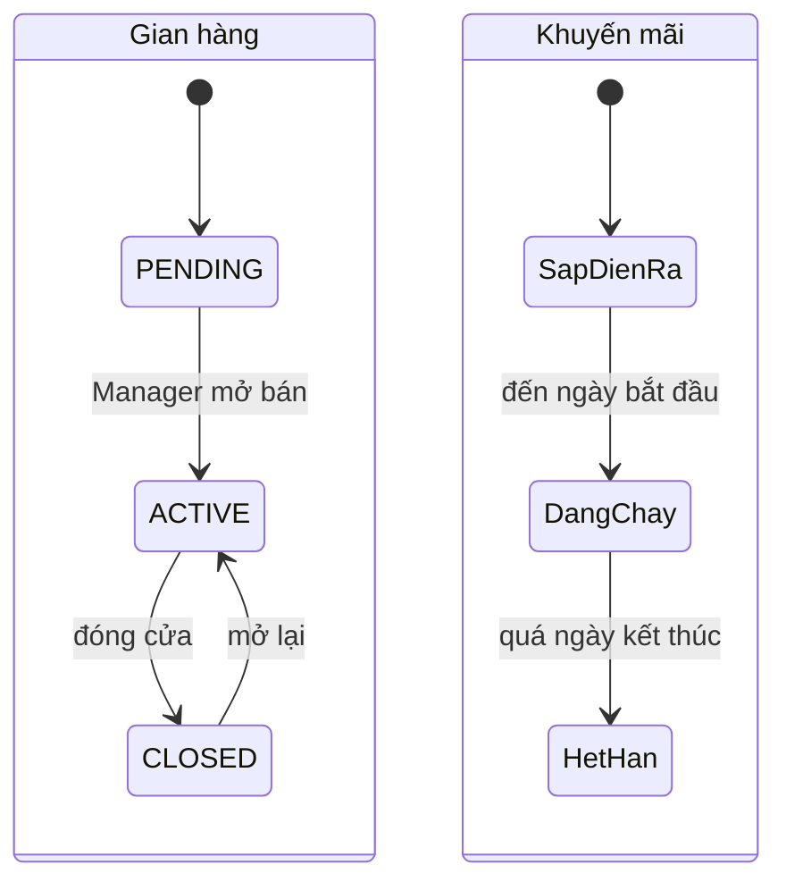
```mermaid
stateDiagram-v2
  state "Gian hàng" as S {
    [*] --> PENDING
    PENDING --> ACTIVE: Manager mở bán
    ACTIVE --> CLOSED: đóng cửa
    CLOSED --> ACTIVE: mở lại
  }
  state "Khuyến mãi" as P {
    [*] --> SapDienRa
    SapDienRa --> DangChay: đến ngày bắt đầu
    DangChay --> HetHan: quá ngày kết thúc
  }
```

### Chuyến đi của khách trên mobile

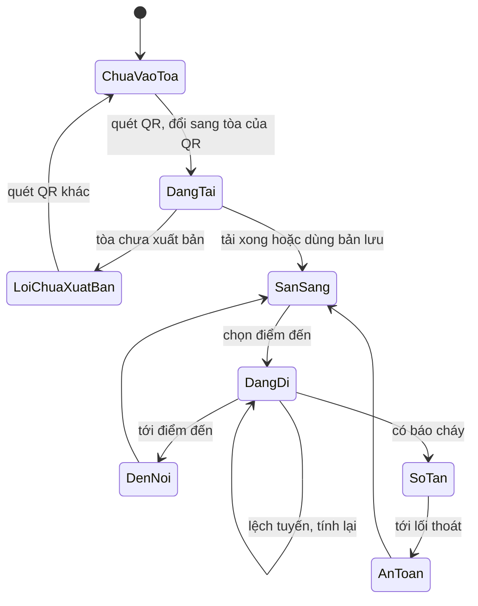
```mermaid
stateDiagram-v2
  [*] --> ChuaVaoToa
  ChuaVaoToa --> DangTai: quét QR, đổi sang tòa của QR
  DangTai --> LoiChuaXuatBan: tòa chưa xuất bản
  DangTai --> SanSang: tải xong hoặc dùng bản lưu
  LoiChuaXuatBan --> ChuaVaoToa: quét QR khác
  SanSang --> DangDi: chọn điểm đến
  DangDi --> DangDi: lệch tuyến, tính lại
  DangDi --> DenNoi: tới điểm đến
  DangDi --> SoTan: có báo cháy
  SoTan --> AnToan: tới lối thoát
  DenNoi --> SanSang
  AnToan --> SanSang
```

## Sơ đồ tuần tự

Các luồng có nhiều bên tham gia.

### Thiết lập tòa rồi khách dùng

Từ lúc Owner gán Manager tới khi khách quét QR.

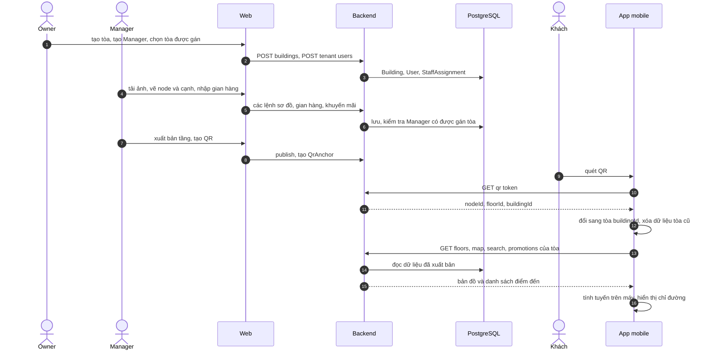
```mermaid
sequenceDiagram
  autonumber
  actor OW as Owner
  actor MG as Manager
  participant WEB as Web
  participant BE as Backend
  participant DB as PostgreSQL
  actor GU as Khách
  participant APP as App mobile
  OW->>WEB: tạo tòa, tạo Manager, chọn tòa được gán
  WEB->>BE: POST buildings, POST tenant users
  BE->>DB: Building, User, StaffAssignment
  MG->>WEB: tải ảnh, vẽ node và cạnh, nhập gian hàng
  WEB->>BE: các lệnh sơ đồ, gian hàng, khuyến mãi
  BE->>DB: lưu, kiểm tra Manager có được gán tòa
  MG->>WEB: xuất bản tầng, tạo QR
  WEB->>BE: publish, tạo QrAnchor
  GU->>APP: quét QR
  APP->>BE: GET qr token
  BE-->>APP: nodeId, floorId, buildingId
  APP->>APP: đổi sang tòa buildingId, xóa dữ liệu tòa cũ
  APP->>BE: GET floors, map, search, promotions của tòa
  BE->>DB: đọc dữ liệu đã xuất bản
  BE-->>APP: bản đồ và danh sách điểm đến
  APP->>APP: tính tuyến trên máy, hiển thị chỉ đường
```

### Manager điều hành, khách nhận thời gian thực

Áp dụng cho thang hỏng, cúp điện, đóng khu vực, thông báo. Độ trễ tối đa khoảng 5 giây.

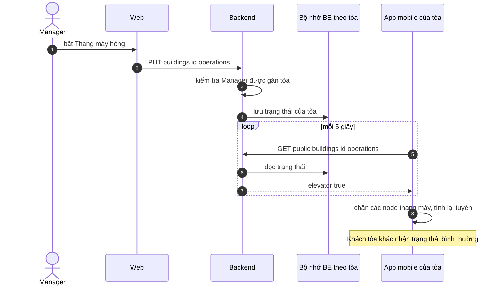
```mermaid
sequenceDiagram
  autonumber
  actor MG as Manager
  participant WEB as Web
  participant BE as Backend
  participant MEM as Bộ nhớ BE theo tòa
  participant APP as App mobile của tòa
  MG->>WEB: bật Thang máy hỏng
  WEB->>BE: PUT buildings id operations
  BE->>BE: kiểm tra Manager được gán tòa
  BE->>MEM: lưu trạng thái của tòa
  loop mỗi 5 giây
    APP->>BE: GET public buildings id operations
    BE->>MEM: đọc trạng thái
    BE-->>APP: elevator true
  end
  APP->>APP: chặn các node thang máy, tính lại tuyến
  Note over APP: Khách tòa khác nhận trạng thái bình thường
```

### Báo cháy và sơ tán

Khách được chia đều theo lối thoát để tránh dồn một cửa.

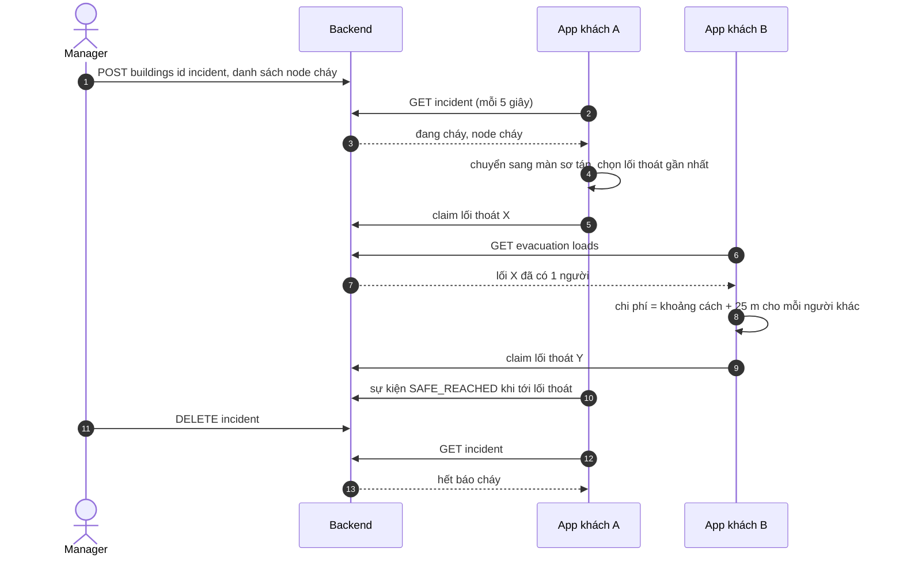
```mermaid
sequenceDiagram
  autonumber
  actor MG as Manager
  participant BE as Backend
  participant A as App khách A
  participant B as App khách B
  MG->>BE: POST buildings id incident, danh sách node cháy
  A->>BE: GET incident (mỗi 5 giây)
  BE-->>A: đang cháy, node cháy
  A->>A: chuyển sang màn sơ tán, chọn lối thoát gần nhất
  A->>BE: claim lối thoát X
  B->>BE: GET evacuation loads
  BE-->>B: lối X đã có 1 người
  B->>B: chi phí = khoảng cách + 25 m cho mỗi người khác
  B->>BE: claim lối thoát Y
  A->>BE: sự kiện SAFE_REACHED khi tới lối thoát
  MG->>BE: DELETE incident
  A->>BE: GET incident
  BE-->>A: hết báo cháy
```

### Đường đi của sự kiện phân tích

Outbox bảo đảm không mất sự kiện khi MongoDB tạm thời không kết nối được.

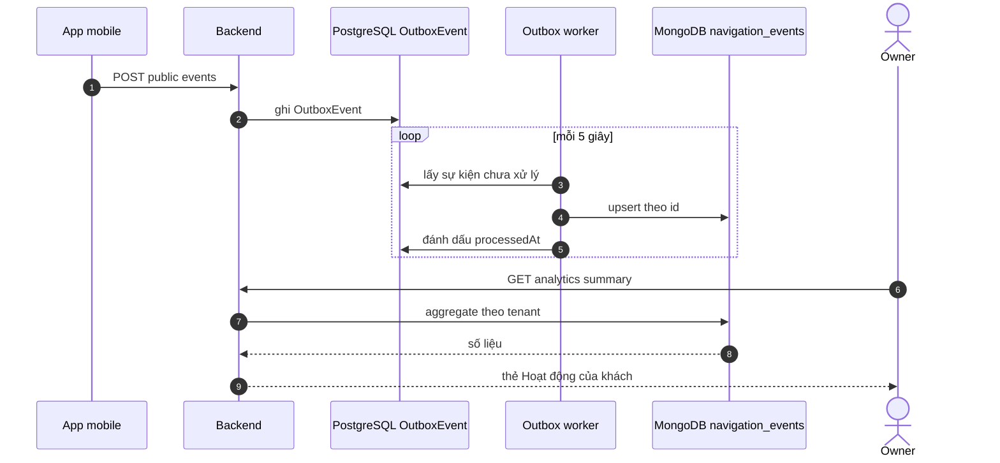
```mermaid
sequenceDiagram
  autonumber
  participant APP as App mobile
  participant BE as Backend
  participant PG as PostgreSQL OutboxEvent
  participant W as Outbox worker
  participant MGO as MongoDB navigation_events
  actor OW as Owner
  APP->>BE: POST public events
  BE->>PG: ghi OutboxEvent
  loop mỗi 5 giây
    W->>PG: lấy sự kiện chưa xử lý
    W->>MGO: upsert theo id
    W->>PG: đánh dấu processedAt
  end
  OW->>BE: GET analytics summary
  BE->>MGO: aggregate theo tenant
  MGO-->>BE: số liệu
  BE-->>OW: thẻ Hoạt động của khách
```

## Cần đối chiếu trước khi nộp báo cáo

- Báo cháy và trạng thái điều hành lưu trong bộ nhớ của BE, chỉ chạy được một bản BE. Khởi động lại BE thì về bình thường.
- Tên dịch vụ email, OAuth và nơi lưu ảnh trong sơ đồ context nên được đối chiếu với cấu hình triển khai thật trước khi đưa vào báo cáo.
- Mobile mặc định mở SpotWay Plaza khi chưa quét QR (để nút xem thử hoạt động); quét QR của tòa khác thì đổi sang tòa đó.
